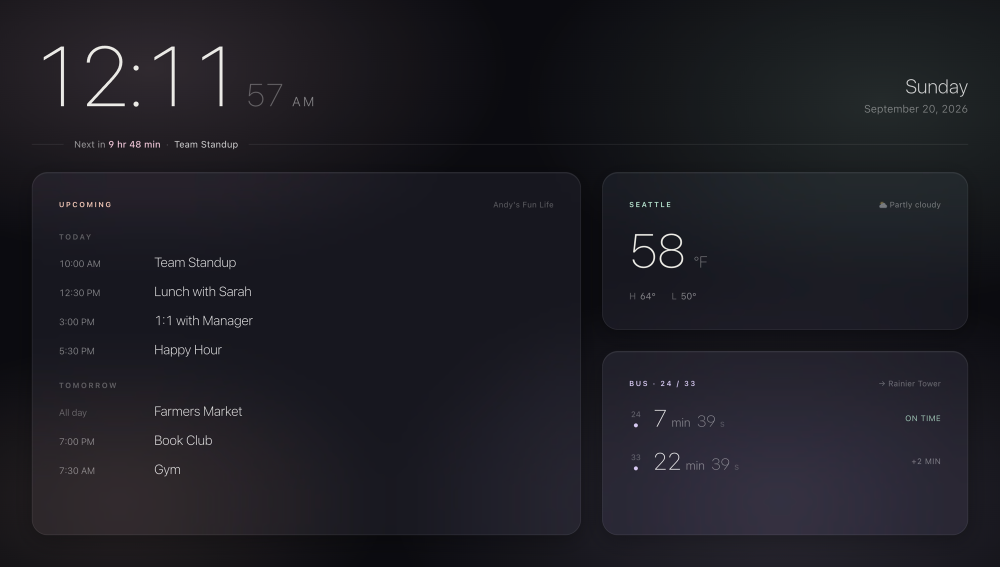

# TV Dashboard

Just a simple personal TV Dashboard with calendar and transit times, built with React.



## Setup

```bash
npm install
cp .env.example .env
npm run dev
```

Fill in `.env` with your credentials. Run `npm run auth:google` for the Google Calendar OAuth flow — it opens a browser, you authorize, and prints your refresh token and calendar ID.

Weather uses [Open-Meteo](https://open-meteo.com) (no key needed). Bus uses the OneBusAway Puget Sound API (`TEST` key works).
